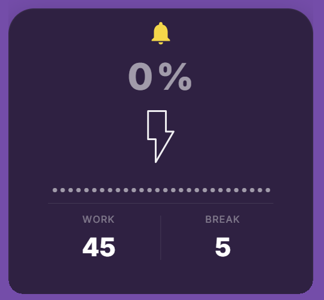

# Pavlok: Touch Grass

Desktop widget for Pavlok that tracks your activity/rest balance and sends Pavlok alerts when fatigue reaches 100%.

## What The App Monitors

The app checks your **system idle time** once per second (Windows `GetLastInputInfo`).

Every 60 seconds it evaluates the last minute:

- If you were active for at least 10 seconds in that minute: fatigue goes **up by 1**
- If you were not active enough: fatigue goes **down by 1** (to a minimum of 0)

Fatigue percent is:

- `fatigue / WORK * 100`

Where:

- `WORK` = minutes of active work to reach 100% (default `45`)
- `BREAK` = consecutive rest minutes needed to fully reset fatigue to 0% (default `5`)

When fatigue reaches or exceeds `WORK` (100%), the app sends a Pavlok stimulus (`beep`, `vibe`, or `zap`) with a 60-second cooldown between sends.

## How to use

1. Download and run the portable EXE from Releases: https://github.com/afaustov/pavlok-touch-grass/releases
2. Get your API key from Pavlok docs: https://pavlok.readme.io/reference/intro/authentication
3. Paste the token into the widget field `Input your API Key here`
4. Set your `WORK` and `BREAK` intervals
5. Click the bolt icon to start monitoring

Accepted formats:

- `your_jwt_token_here`
- `Bearer your_jwt_token_here`

## Tray Behavior

- Single left-click on tray icon toggles widget visibility (hide/show)
- Only one app instance can run at a time; launching again brings back the existing window
- Tray menu includes:
  - `Get API Key`
  - `Reset Fatigue`
  - `Quit`
